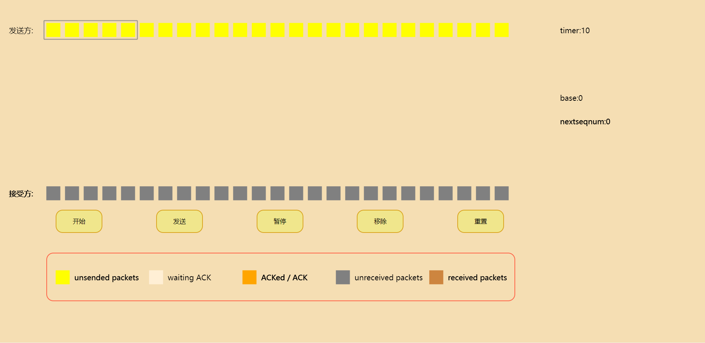
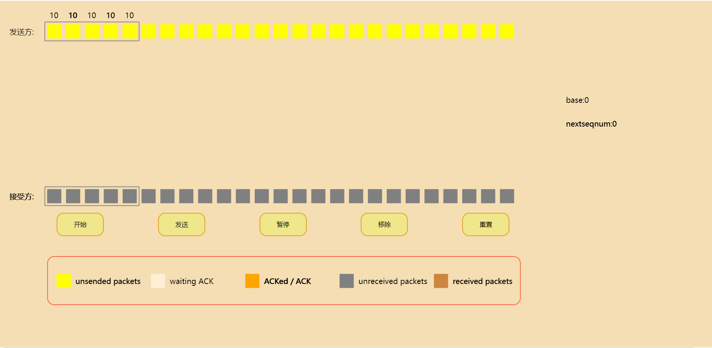

# README

# 1 Background

项目是计算机网络课程的辅助课件，使用交互式的可视化方式，生动形象的描绘了计算机网络中可靠传输中的两种机制：回退N步(GBN)和选择重传(SR)。

参考教程为：《计算机网络：自顶向下方法》机械出版社第七版

## 2 Detail

GBN：

SR：

按钮用于交互：发送和删除分组包，用来模拟分组包的发送和丢失；滑动窗口机制也在图中展示；界面下方描述了不同颜色的分组包代表的含义。

## 3 Usage&Install

- 项目使用前端三件套编写，需要教程的可以访问[W3school](https://www.w3school.com.cn/)
- 建议使用Vscode部署项目，其中有一个扩展插件为Live Server可以一键部署到浏览器上，很方便
- 项目很简单，可以直接克隆到本地，无需环境配置

## 4 Notice

- 项目由我和另外一个同学共同完成，仅做学习交流使用